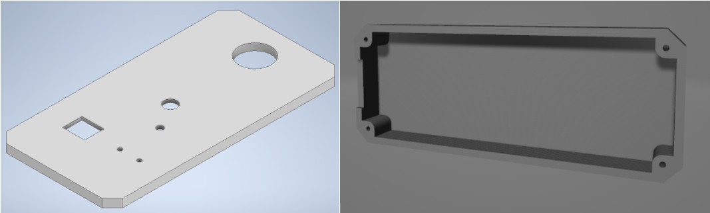
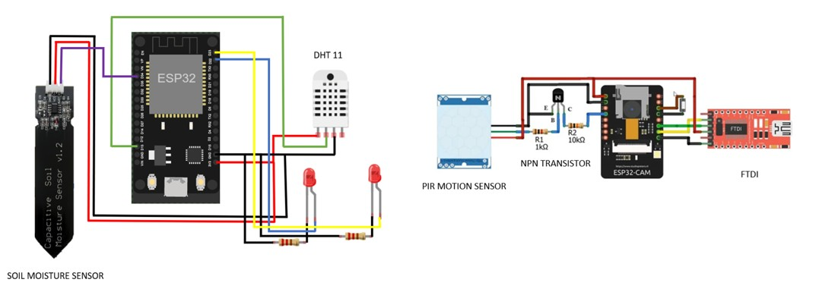
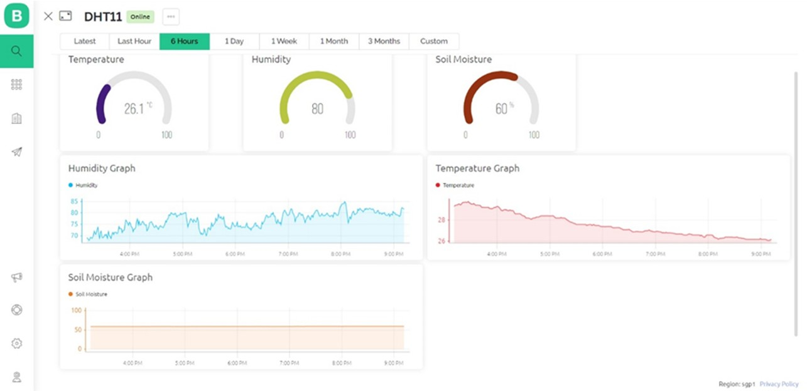
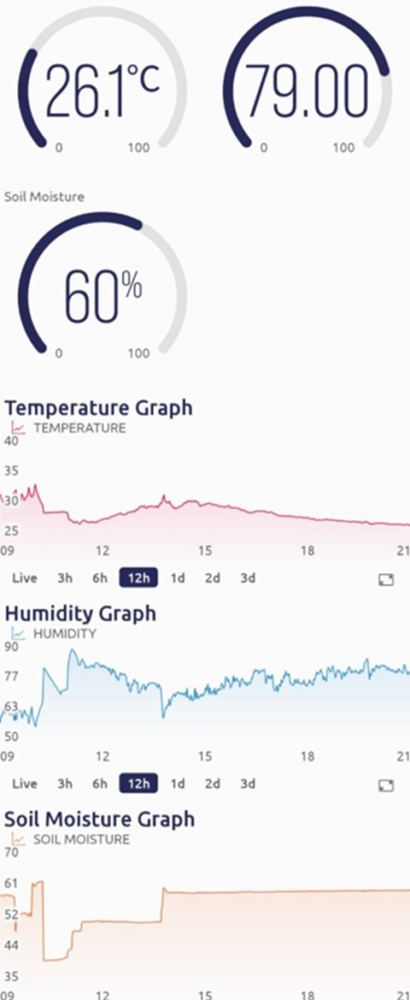
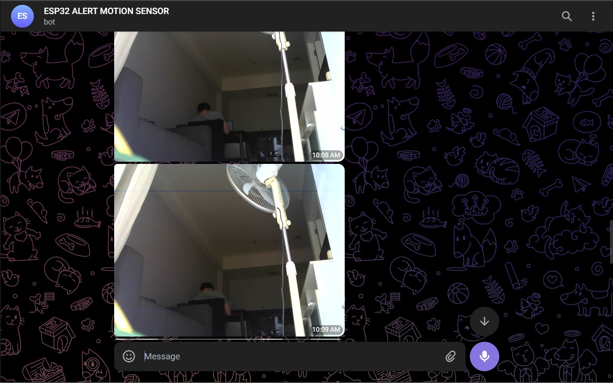
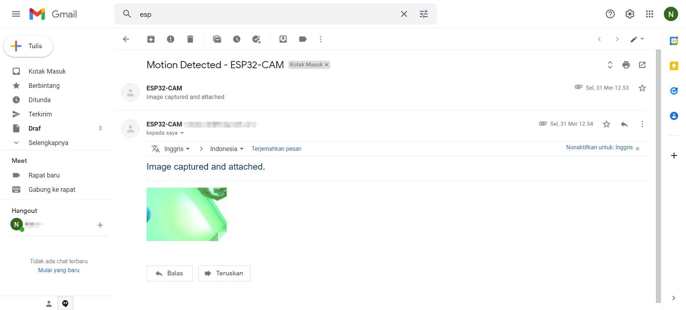

# IoT Based Plant Security and Monitoring System

The ESP32-CAM is a full-featured microcontroller with an integrated video camera and microSD card socket. It is inexpensive, easy to use, and perfect for IoT devices requiring a camera with advanced functions like image tracking and recognition. The ESP32-CAM module has fewer I/O pins than the ESP-32 module. Many GPIO pins are used internally for the camera and the microSD card port. Another thing missing from the ESP32-CAM module is a USB port. To program this device, I need to use an FTDI adapter. Since the ESP32 and ESP32-CAM support IoT features, I am interested in making a project on agriculture technology by combining the IoT features with the sensor and camera. For example, soil moisture sensors have many applications in agriculture, research, and everyday gardening. By keeping tabs on the amount of water in the soil, we can make sure our precious crop stays hydrated or get an idea of the conditions before planting. Moreover, I also use DHT11 - This low-cost temperature sensor also measures humidity. It has a serial digital output and can easily be used with most microcontrollers.

## Required Components
- ESP32
- ESP32-CAM
- FTDI Programmer Module
- PIR Motion Sensor
- NPN Transistor
- 1k and 10k Resistors
- Capacitive Soil Moisture Sensor
- DHT11 Temperature and Humidity Sensor
- LED
- SD Card

## 3D Design Preview

## System Interconnection Preview

## User Interface of Blynk App in PC and Smartphone

## Camera Surveillance System with Telegram Bot and Email

## Project Overview

IoT Based Plant Security and Monitoring System is a device intended for agriculture. This device is equipped with ESP32-CAM that has a built-in flash in it. In addition, the device also used ESP32 as the microcontroller that connects to the soil moisture sensor and DHT11 Temperature and Humidity Sensor. The soil moisture sensor that is used in the device is a capacitive soil moisture sensor. As it does not need direct electrical contact with the soil, it can be insulated from corrosion, eliminating many of the disadvantages inherent to resistive sensors.

When we switch the device on, the soil moisture sensor and the temperature and humidity sensor will start to get data from around and send it to Blynk App wirelessly through WiFi so the data can be visualized as a line graph. While the sensors' data are already beyond the threshold we have set, the LED will turn from green to red. Furthermore, I have to set up the telegram bot and my email as media to send the camera capture when motion is detected around the PIR Motion Sensor.
